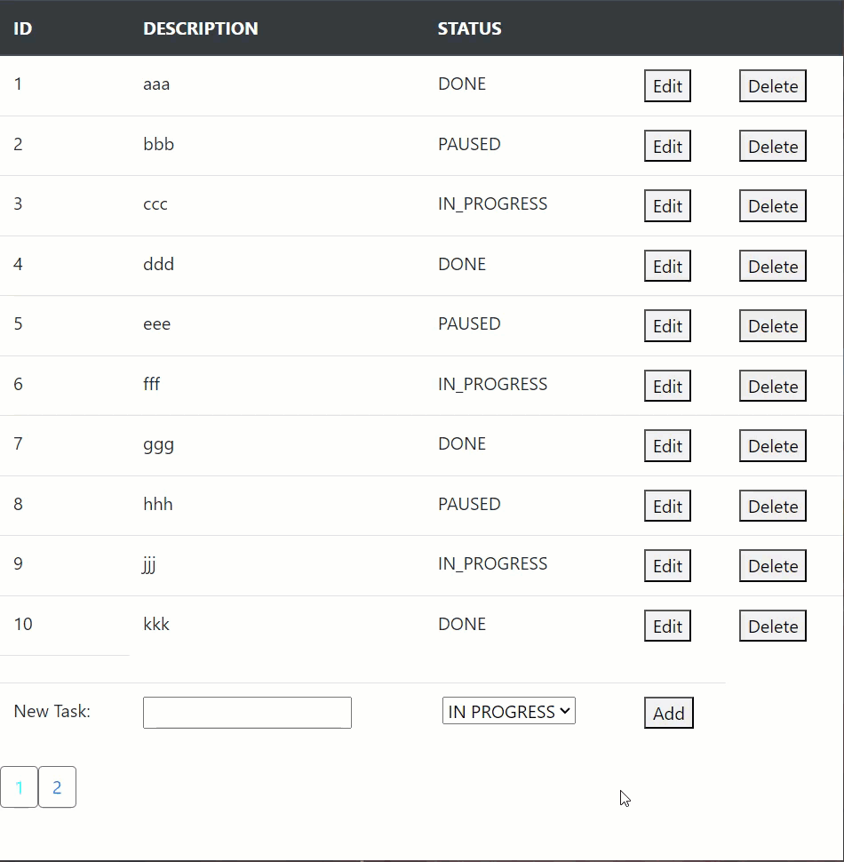

# **TODO-LIST**
___

### Description
Web application "ToDo-List" - is  a notebook for creating and tracking task progress status. Essentially, this is an 
implementation of CRUD functionality using Spring MVC technology.

_Application Options:_
- Creating tasks;
- Editing tasks;
- Changing task progress status;
- Deleting tasks;
___
### Requirements
To run the application, Docker must be installed.
___
### Application launch
1. From the project's root folder, execute the command: `docker-compose --env-file secrets.env up`
2. After all necessary modules are automatically installed use context to run: `http://localhost:8080/todolist/`
___
### Class description
The package `config` contains all necessary classes for application configuration:
- `AppConfig` - for configuring the beans in the application context such as data source, transaction manager, sessionFactory;
- `WebAppInitializer` - for initializing the web application context;
- `WebConfig` - class for configuring the Spring MVC framework.

The package `controller` contains the class:
- `TaskController` - for handling HTTP requests from clients, processing them, and returning an appropriate response.

The package `dao` contains the class:
- `TaskDAO` - used to handle data persistence and operations for an entity (Task).

The package `domain` contains the classes:
- `Status` - enum stores a task progress statuses;
- `Task` - main entity class.

The package `dto` contains the class:
- `TaskDTO` - represent data that is being transferred between different layers of an application.

The package `service` contains the class:
- `TaskService` - contains business logic (CRUD) and acts as an intermediary between the TaskController and TaskDAO layers.
___
### Resource description
The directory `resources` contains 
- `application.properties` - environment variables for datasource;
- `spy.properties` - configure the data source connection pool settings for the Spring.
___
### Test classes
The package `test` contains classes for testing:
- `TaskServiceTest` - CRUD logic Junit testing ;
- ...in progress...
___
### Webapp description
The directory `webapp` contains folders:
- `view` - contains main page: `tasks.html`.
- `script` - contains `jquery-3.6.4.min.js` and `crud.jsp` for `tasks.html` page.
- `css` - contains manual settings for style in `tasks.html`.
___
### **TESTS**

